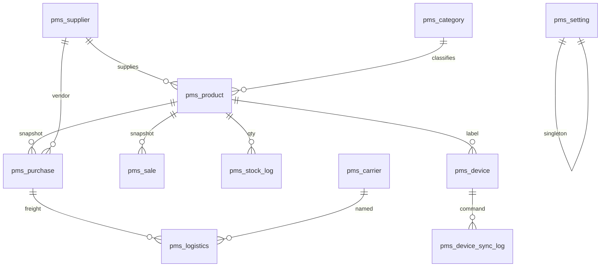

# PMS 表结构

业务表 12 张（含物流商）。商品档案是**当前快照**；进货、销售、库存流水才是历史。

## 快照 vs 流水

| 表 | 角色 |
| --- | --- |
| `pms_product` | 当前名称、规格、分类、厂家、进价、售价、库存 |
| `pms_purchase` | 进货台账（只增）。写入后更新商品进价/厂家/库存 |
| `pms_sale` | 销售台账（只增）。扣减库存，是营业额数据源 |
| `pms_stock_log` | 每次库存变动一条（入库/盘点/损耗/调拨/销售/建档） |

改商品进价**不会**自动生成进货流水。新建商品且库存 > 0 会自动记一笔首次进货。

## 物流关系

`pms_logistics.purchase_id` → 一笔进货批次（运费不按 SKU 分摊）。

`carrier_id` → `pms_carrier`；`carrier` 存名称快照。有账单时禁止删除物流商。物流单禁止删除。

## 墨水屏

`pms_device.product_id` 可空（未绑定）。`pms_device_sync_log` 记录 refresh/restart/unbind，`sync_status=2` 表示待设备确认。

`pms_setting` 单行 `setting_id=1`：预警阈值、展示字段、`eink_sync_interval_sec`（轮询间隔，0 表示 5 秒）。

## 表清单

| 表 | 说明 |
| --- | --- |
| `pms_supplier` | 进货厂家 |
| `pms_category` | 商品分类 |
| `pms_product` | 商品档案（快照） |
| `pms_purchase` | 进货台账 |
| `pms_stock_log` | 库存流水 |
| `pms_sale` | 销售出库 |
| `pms_logistics` | 物流对账 |
| `pms_carrier` | 物流商 |
| `pms_device` | 墨水屏设备 |
| `pms_device_sync_log` | 设备同步/指令日志 |
| `pms_setting` | 业务配置（单行） |

完整 DDL 见 `sql/pms.sql`（已有库补物流商用 `sql/pms_carrier.sql`）。
